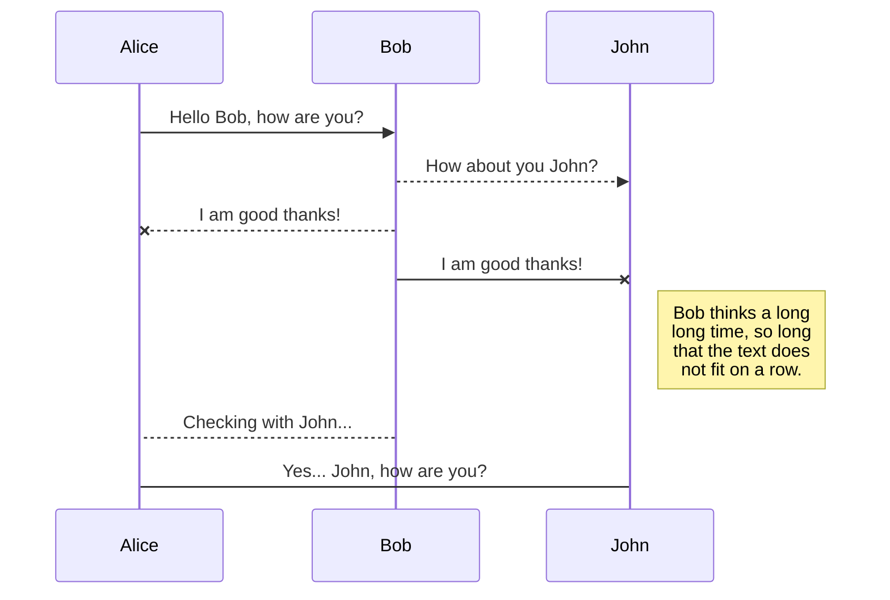
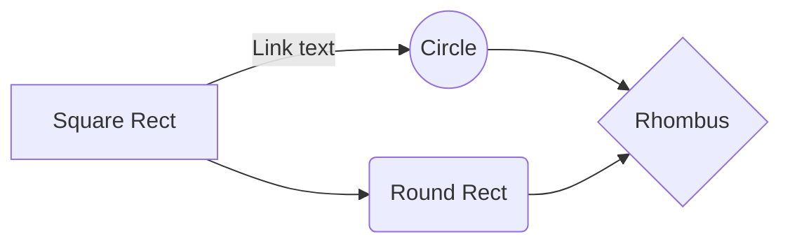

# DRCDV Technical Documentation (UNDER DEVELOPMENT!)

## **1. Introduction**

Welcome to the documentation for **DRCDV**, the **Dynamic and Responsive Chat Application with Data Visualization** project.

- **Purpose**:

This project aims to develop a front-end for a chat application using React, focusing on creating a dynamic, interactive UI that seamlessly integrates with back-end services. The application supports text messages and visualizes various data types (tabular, images, text, etc.) dynamically within the chat interface.

- **Scope**:

The documentation provided includes a system overview, installation and setup instructions, usage guidelines, API details, code documentation, as well as deployment and testing procedures.

#### **2. System Overview**

- **Project Description**:

The application primarily offers a list of users, allowing the initiation of chats with one or more individuals. Users can exchange text messages, images, data visualization files, and code snippets. However, all users must register their credentials to access the chat space and connect with others.

Note that the main driving assumption is that **DRCDV is a sub-application within a larger-scaled business platform**, so all users recorded in the database are contactable.

## **3. Installation and Setup**

## **4. Usage Guidelines**

## **5. API Details**

#### Channels API

### `listChannels`

**_Description_**:

This function fetches the list of channels where the user is a member.

**Parameters**:

- `queryParams` (object):

- `userId`: the ID of the user for whom the channels need to be fetched

- `token`: the authentication token of the user

**_Return_**:

The function constructs a URL with the provided query parameters and sends a GET request to the backend API. If the request is successful, it *return*s the fetched data. Otherwise, it throws an error.

### `createChannel`

**_Description_**:

This function creates a new channel in the backend.

**Parameters**:

- `token`: the authentication token of the user creating the channel

- `channel`: an object containing the details of the new channel, such as the title and the members

**_Return_**:

The function sends a POST request to the backend API with the channel data. If the request is successful, it *return*s the created channel data. Otherwise, it throws an error.

### `checkChannelExists`

**_Description_**:

This function checks if a channel already exists between two users.

**Parameters**:

- `userId1`: the ID of the first user

- `userId2`: the ID of the second user

**_Return_**:

The function constructs a URL with the provided user IDs and sends a GET request to the backend API. If the request is successful, it *return*s a boolean value indicating whether the channel exists or not. Otherwise, it throws an error.

### `getChannelById`

**_Description_**:

This function fetches the details of a single channel by its ID.

**Parameters**:

- `channelId`: the ID of the channel to be fetched

- `token`: the authentication token of the user

**_Return_**:

The function sends a GET request to the backend API with the channel ID. If the request is successful, it *return*s the fetched channel data. Otherwise, it throws an error.

### `getChannelMessages`

**_Description_**:

This function fetches the messages in a channel by its ID.

**Parameters**:

- `channelId`: the ID of the channel for which the messages need to be fetched

- `token`: the authentication token of the user

**_Return_**:

The function sends a GET request to the backend API with the channel ID. If the request is successful, it *return*s the fetched messages. Otherwise, it throws an error.

### `getMessagesByChannelId`

**_Description_**:

This function fetches the messages in a channel by its ID.

**Parameters**:

- `channelId`: the ID of the channel for which the messages need to be fetched

- `token`: the authentication token of the user

**_Return_**:

The function sends a GET request to the backend API with the channel ID. If the request is successful, it *return*s the fetched messages. Otherwise, it throws an error.

#### Users API

### `signup`

**_Description_**:

This function handles the user signup process.

**Parameters**:

- `formData` (object): the user's signup information (e.g., username, password)

**_Return_**:

The function sends a POST request to the backend API with the form data. If the request is successful, it *return*s the user's signup response. Otherwise, it throws an error.

### `getUserProfileImage`

**_Description_**:

This function fetches the profile image of a user by their ID.

**Parameters**:

- `userId`: the ID of the user whose profile image needs to be fetched

**_Return_**:

The function sends a GET request to the backend API to retrieve the user's profile image. If the request is successful, it *return*s the profile image data (as a Blob). Otherwise, it throws an error.

### `login`

**_Description_**:

This function handles the user login process.

**_Parameters_**:

- `username` and `password` (object): the user's login credentials

**_Return_**:

The function sends a POST request to the backend API with the login credentials. If the request is successful, it *return*s the user's login response. Otherwise, it throws an error.

### `getUserInfo`

**_Description_**:

This function fetches the information of a user by their ID.

**Parameters**:

- `id`: the ID of the user whose information needs to be fetched

**_Return_**:

The function sends a GET request to the backend API to retrieve the user's information. If the request is successful, it *return*s the user's information. Otherwise, it throws an error.

### `getUsers`

**_Description_**:

This function fetches the list of all users.

**Parameters**:

- `queryParams` (object): optional query parameters to filter the list of users

**_Return_**:

The function sends a GET request to the backend API with the provided query parameters. If the request is successful, it *return*s the list of users. Otherwise, it throws an error.

## **6. Code Documentation**

### Channels: creating, opening, and displaying flow:

1.  **_Channels Creating Flow_**:

- When a user signs up and logs in for the first time, the application automatically creates channels (direct message channels) between the new user and all other existing users.

- This is handled in the `UserHomeProvider` component, which uses the `useQuery` hook to fetch the list of channels for the current user's ID (`userId`).

- The `listChannels` API is called with the `userId` parameter to retrieve the user's channels.

- If the list of channels is not empty, the `isVisible` state is set to `true`, indicating that the channels should be displayed.

2.  **_Channels Opening Flow_**:

- The `ConnectionsList` component is responsible for displaying the list of direct message channels for the current user.

- It filters the `channels` array to only include direct message channels (where the `members.length` is less than 3).

- For each direct message channel, it renders a `ListGroup.Item` component, which displays the other user's profile image, name, and username.

- When a user clicks on a `ListGroup.Item`, the `handleChannelClick` function is called, which updates the `selectedChannel` in the `ChannelContext`.

3.  **_Channels Displaying Flow_**:

- The `ChannelsList` component is responsible for displaying the list of channels (both direct message and group channels) for the current user.

- It filters the `channels` array to only include channels where the number of members is greater than 2 (i.e., group channels).

- For each channel, it renders a `ChannelCard` component, which displays the channel's title and member count.

- When a user clicks on a `ChannelCard`, the `handleChannelClick` function is called, which updates the `selectedChannel` in the `ChannelContext`.

The `ChannelContext` is a central context that manages the state related to the currently selected channel, the channel messages, the channel members, and the avatar states for the members. It provides functions to set the selected channel, update the channel messages, set the channel members, fetch and manage user avatars, and manage the attachment cache.

The `UserHomeContext` is responsible for managing the visibility of the channels display based on whether the user has any channels. It provides a `toggleVisibility` function to show or hide the channels display.

Overall, the channels creating, opening, and displaying flow is designed to provide a seamless experience for users to access their direct message and group channels, with optimized avatar handling and attachment caching to improve performance and user experience.

### Message Creation & Sending Flow

### 1. Message Creation Process

The message creation process starts in the `CreateMessage` component and follows these steps:

#### Initial Setup

- Component uses `useMessageManagement` hook which manages:

- Message text state

- Attachments state

- Sending state

- User authentication

- Socket connection

#### Message Submission Flow

1. User types message and/or adds attachments

2. On form submission:

- Prevents default form behavior

- Validates message (must have text and not already sending)

- Creates message object with:

- Text content

- Any attachments

- Channel ID

3. Optimistic Update:

- Creates temporary message with `createTempMessage`

- Adds to channel messages immediately

- Shows with pending state (opacity: 0.7)

#### Socket Communication

1. Message sent to server via socket:

```javascript
socket.emit('createMessage', {
  userId,

  channelId,

  messageData: {
    text,

    attachments,

    tempId,
  },
})
```

2. Server processes message and emits 'messageCreated' event

3. Client receives confirmation and:

- Removes temporary message

- Adds confirmed message

- Clears input fields

- Resets sending state

### 2. Message Rendering Process

#### Message Component Structure

```

Message

├── MessageContent

│ ├── Avatar (for non-current users)

│ ├── SenderName

│ └── Attachments

```

#### Rendering Logic

1. Message Identification:

- Determines if sender is current user

- Resolves sender information from channel members

2. Styling Application:

- Current user messages:

- Right-aligned

- Green background (#1CCB8F)

- Other user messages:

- Left-aligned

- Black background

- Pending messages:

- Reduced opacity

- Slightly scaled down

3. Avatar Handling:

- Only shown for non-current users

- Managed by ChannelContext

- States: loading, loaded, failed, idle

- Implements lazy loading and caching

### 3. Context Management

#### Channel Context

- Manages:

- Selected channel

- Channel messages

- Channel members

- Avatar states

- Attachment cache

#### Socket Context

- Provides socket connection

- Handles:

- Connection establishment

- Error handling

- Cross-origin requests

- WebSocket transport

### 4. Optimization Strategies

#### Avatar Management

- Batch processing (2 avatars at a time)

- Caching mechanism

- Validates image quality

- Cleanup of blob URLs

#### Message Updates

- Optimistic updates for better UX

- Temporary message handling

- Efficient state updates

- Attachment caching

### Message Listing Flow (MessageList.jsx):

#### Message Display:

Messages are sorted with pending messages at the end

Each message shows:

User avatar (with lazy loading)

Username (for non-current user messages)

Message text

Attachments (if any)

Different styling for current user vs other users' messages

#### Optimizations:

Uses React.memo for message components

Implements useMemo for expensive calculations

Pre-fetches member avatars

Automatically scrolls to newest messages

Handles loading states with a spinner

#### Key Features:

Optimistic updates (shows message immediately before server confirmation)

Real-time updates via Socket.IO

Responsive design with Bootstrap

Efficient avatar handling with caching

Support for file attachments

Visual feedback for pending messages

Smooth scrolling to new messages

## **7. Deployment**

## **8. Testing Procedures**

## **9. Troubleshooting**

## **10. Contributing**

## **11. License**

## **12. Acknowledgements**

## UML diagrams

placeholder render UML diagrams using [Mermaid](https://mermaidjs.github.io/). For example, this will produce a sequence diagram:



And this will produce a flow chart:


